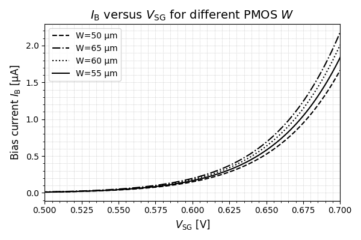
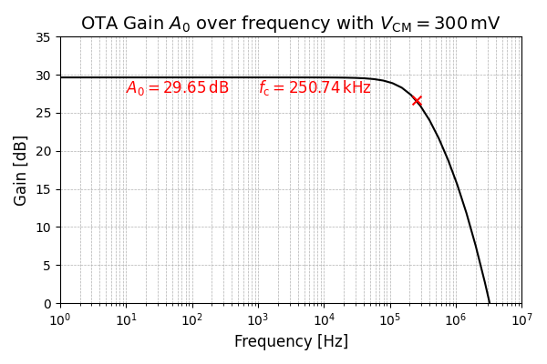
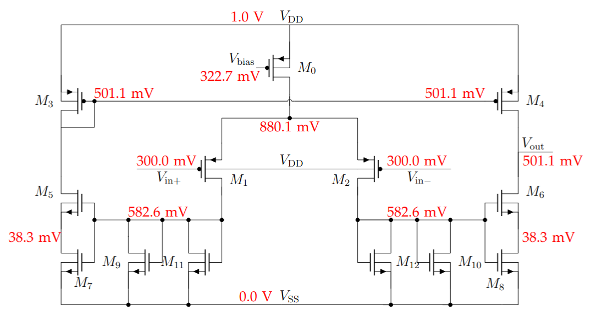
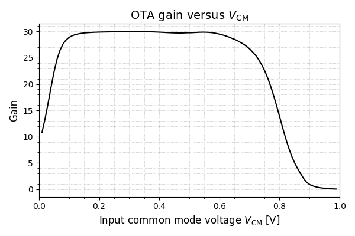

# Low-gm Operational Transconductance Amplifier (OTA)

## Objective
Design a low-power operational transconductance amplifier (OTA) with the following specifications:
- **Supply Voltage:** VDD = 1V
- **Bias Current:** IB = 1µA
- **Transconductance:** Gm < 5µS
- **Differential pair:** Operating in weak inversion region

## Design Evolution

### 1. Initial Simple Low Power OTA

#### Design Strategy
The initial design focused on achieving high gm/ID ratio by operating the PMOS input differential pair in weak inversion (VSG < Vt):

- **Target gm/ID ratio:** ~26 V⁻¹
- **Input transistor current:** ID = IB/2 = 500 nA
- **Achievable transconductance:** gm ≈ 13 µS

  
*Figure 1: LPMOS gm/ID-ratio characteristics*

#### Key Design Parameters

**PMOS Input Differential Pair (M1, M2):**
- Width: W = 200 µm
- Length: L = 647 nm (increased to raise Vt and improve gm/ID)
- VSG ≈ 500 mV (subthreshold operation)
- Common mode voltage: VCM = 360 mV

  
*Figure 2: Threshold voltage dependency on channel length*

**NMOS Current Mirror:**
- Width: W = 0.35 µm (minimum)
- Length: L = 2.5 µm (maximized for high output resistance)

**PMOS Current Mirror:**
- Width: W = 60 µm
- Length: L = 0.37 µm

#### Input Common Mode Range
- **Lower limit:** Vinc,low ≈ 2VOV + Vt (current source must remain in saturation)
- **Upper limit:** Vinc,upp = VDD - VOV (NMOS mirror must remain in saturation)

#### Initial Results
- **Achieved gm:** 13.26 µS
- **Output resistance:** Rout = 2.01 MΩ
- **Overall transconductance:** Gm = 11.8 µS ❌ (does not meet Gm < 5µS requirement)
- **DC output voltage:** 249.8 mV

  
*Figure 3: AC gain of initial OTA design*

---

### 2. Improved Design with Series/Parallel NMOS Current Mirror

#### Improvement Strategy
Replace the simple NMOS current mirror with a series/parallel configuration to:
1. Reduce output current consumption
2. Lower overall transconductance Gm
3. Increase output impedance
4. Improve DC output bias adjustment

#### Series/Parallel Mirror Operation
The output current is reduced according to:

```
Iout = (IB/2) / N²
```

Where N = 2 (number of transistors per branch), resulting in:
- **Output current:** Iout = IB/8 = 125 nA

#### Optimized Parameters

**NMOS Current Mirror:**
- Length: L = 1 µm (enables large input common mode range)
- Series transistors: At output branches (M7, M8)
- Parallel transistors: At gain stage (M9-M12)

  
*Figure 4: Input pair gm versus NMOS length at VCM = 0V*

**PMOS Current Mirror:**
- Width: W = 135.72 µm (adjusted for DC bias)
- Achieves DC output voltage: VDD/2 = 500 mV

**PMOS Bias Current Source (M0):**
- Width: W = 50 µm
- Length: L = 1 µm (reduced channel length modulation)
- VSG = 677.30 mV
- Vds,sat ≈ 60 mV (sufficient headroom)

  
*Figure 7: Bias current dependency on VSG and width*

#### Final Performance
- **Overall transconductance:** Gm = 3.50 µS ✅ (meets requirement)
- **Output resistance:** Rout = 8.67 MΩ
- **DC gain:** A0 = GmRout = 30.37 (29.65 dB)
- **DC output bias:** 501.1 mV (VDD/2)

  
*Figure 5: AC gain of final OTA design at VCM = 300mV*

---

## Final Schematic

  
*Figure 6: Complete OTA schematic with DC node voltages*

### Transistor Operating Points

| Device | Vdsat | Vt | gm | gds | IDS | Operation Region |
|--------|-------|-------|------|------|------|------------------|
| M0 | 57.2 mV | 729.5 mV | 23.8 µS | 461.7 n | 1.01 µA | Strong inversion, Saturation |
| M1,2 | 46.7 mV | 732.7 mV | 13.4 µS | 120.7 nS | 0.5 µA | **Weak inversion** |
| M3,4 | 46.5 mV | 712.4 mV | 3.6 µS | 109.8 nS | 134.5 nA | Strong inversion, Saturation |
| M5,6 | 74.0 mV | 491.1 mV | 2.4 µS | 8.0 nS | 134.5 nA | Strong inversion, Saturation |
| M7,8 | 93.8 mV | 491.1 mV | 1.5 µS | 2.6 µS | 134.5 nA | Strong inversion, Triode |
| M9-12 | 93.8 mV | 491.1 mV | 3.8 µS | 11.8 nS | 253.1 nA | Strong inversion, Saturation |

---

## Input Common Mode Range

The OTA's performance is heavily dependent on the input common mode voltage VCM:

  
*Figure 8: Gain versus input common mode voltage*

**Operating Range:** ~100 mV to ~650 mV

- **Below 100 mV:** Input differential pair VSD too low → increased gds → reduced gain
- **Above 650 mV:** Bias current source cannot provide sufficient current → reduced gain

---

## Key Design Insights

1. **Weak Inversion Operation:** Operating the input differential pair in subthreshold region achieves high gm/ID ratio (~26 V⁻¹), enabling low power consumption

2. **Series/Parallel Current Mirror:** Reduces output current by N² factor while increasing output impedance significantly

3. **Channel Length Optimization:** 
   - Longer NMOS mirror length increases output resistance
   - Slightly longer input pair length increases Vt and improves gm/ID

4. **Trade-offs:**
   - Output DC bias vs. PMOS current mirror size
   - Input common mode range vs. bias current headroom
   - Area consumption vs. performance specifications

---

## Specifications Met

| Specification | Target | Achieved | Status |
|---------------|--------|----------|--------|
| Supply Voltage | 1V | 1V | ✅ |
| Bias Current | 1µA | 1.01µA | ✅ |
| Transconductance | < 5µS | 3.50µS | ✅ |
| Input Pair Region | Weak inversion | Weak inversion | ✅ |
| DC Output Bias | ~VDD/2 | 501.1 mV | ✅ |

---

